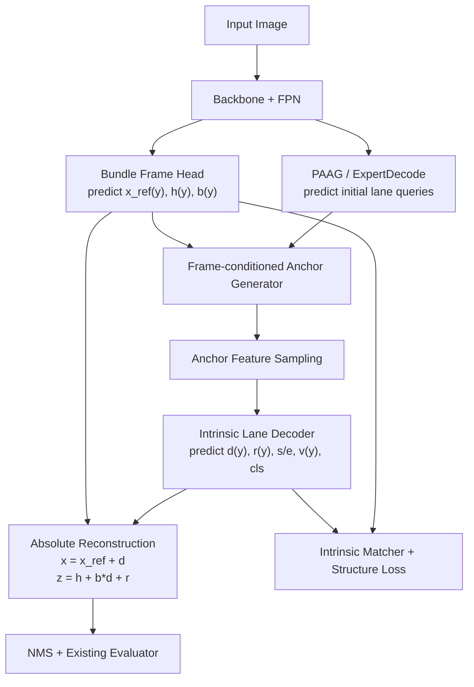

# BundleLane V1 方法设计文档

## 1. 文档定位

本文档重新定义当前阶段的研究主线。

它不再把 `Anchor3DLane++` 当作需要不断补充 auxiliary trick 的基线，而是把单目 3D 车道线检测重新表述为一个**局部参考系推理问题**：

- 先预测当前场景内多条车道共享的 `lane bundle frame`
- 再在该参考系中解码每条车道的相对几何与有效区间
- 最后恢复绝对 3D 车道线并复用现有评测协议

本文档聚焦：

- 方法的核心创新点
- 灵感来源与理论基础
- 表示设计与几何定义
- 训练目标与匹配逻辑
- 与现有工作的边界
- 第一版工程落地的边界与风险

### 1.1 术语说明

为了避免文档读起来像只写给本方向研究者的摘要，下面先统一解释本文会反复出现的专业术语。后文再次出现这些词时，默认都按这里的含义理解。

- `auxiliary trick / auxiliary head / auxiliary loss`
  指附加在主模型上的辅助模块或辅助损失。它们可以帮助训练，但不改变任务最核心的表示方式。比如“多加一个端点损失”通常属于 auxiliary trick。
- `absolute curve regression`
  指直接回归每条车道在世界坐标中的绝对曲线，例如直接预测 `x(y)`、`z(y)`。它的缺点是共享道路几何和单条车道差异都混在一起学习。
- `Frenet` 坐标
  指相对道路参考线建立的局部坐标系。直观理解是：不直接问“点在世界坐标哪里”，而是问“它沿着道路走了多远、偏离参考线多远”。
- `gauge freedom`
  可理解为“参考系没有固定好带来的自由度”。同一组观测，有时可以用多种等价参数解释；如果不先固定参考系，网络就会把精力浪费在这些等价变化上，而不是学习真正想要的结构。
- `nuisance factor`
  指会影响观测、但本身不是目标的干扰因素。比如相机 pitch、路面纵坡、横坡会影响图像里的车道外观，但它们并不等同于“车道本身的几何”。
- `local chart`
  指只在局部区域有效的参数化方式。它不是全局模板，而是“在这一小片场景里，用一套局部坐标把结构描述清楚”。
- `lane bundle`
  指同一场景中一组共享道路骨架的相邻车道。它们不是完全独立的曲线，而是一组共同依附在同一道路结构上的 lane。
- `bundle frame`
  指为一个 `lane bundle` 建立的局部参考系。本文中它由 `x_ref(y)`、`h(y)`、`b(y)` 三个函数组成，分别表示参考横向中心、参考高度和横坡。
- `intrinsic / intrinsic space`
  指在 `bundle frame` 中表达车道的相对坐标空间。这里的“内禀”可以简单理解为“相对于道路自身结构来描述”，而不是相对于全局世界坐标来描述。
- `support interval`
  指一条车道在线性采样轴上的有效存在区间，也就是“这条车道从哪里开始、到哪里结束”。它强调的是结构存在范围，不等同于单纯的遮挡可见性。
- `residual`
  指减去共享主趋势后剩下的局部小偏差。比如先用共享 frame 解释大部分高度变化，再让 `residual` 只补局部误差。
- `matcher`
  指训练时负责把预测结果和 GT 一一对应配对的模块。当前很多方法用 Hungarian matching；本文说“把 matcher 放到 intrinsic space”就是指配对时不再只看绝对 `x/z` 距离。
- `dense road surface GT`
  指对整片路面的密集高度标注，例如很多像素或很多地面网格位置都有高度监督。本文当前不假设这种标注存在。
- `BEV-free`
  指不先把图像显式变换成鸟瞰图再检测，而是直接在前视图特征和 3D anchor 投影上做建模。
- `Huber` 拟合 / `IRLS`
  都是鲁棒拟合方法，用来减小异常点对拟合结果的破坏。第一版里提它们，是因为少量错误 lane 点不应该把整个 frame 拟合带偏。

## 2. 核心判断

### 2.1 为什么不继续沿用 `profile + endpoint` 主线

此前方案的出发点是合理的，但本质上仍是对现有 `absolute curve regression` 的局部修补：

- `profile-aware` 改进的是共享路面高度先验
- `endpoint-aware` 改进的是车道起止点监督

这两点都能提升稳定性，但没有改变任务定义本身。

当前单目 3D 车道线检测最深层的问题不是“某个模块不够强”，而是网络被迫同时学习以下几类互相纠缠的因素：

- 相机姿态变化
- 路面纵向起伏
- 路面横坡变化
- 车道相对位置关系
- 车道出现与消失的有效区间
- 遮挡与可见性

如果输出仍然定义成“每条 lane 的绝对 `x/z/vis` 点集”，那么无论后面加多少 loss，网络本质上都在回归一个混合变量。

### 2.2 新方案的目标

V1 的目标不是引入更多模块，而是把问题分解方式改对：

- 先估计**共享低频几何**
- 再估计**单条车道相对共享几何的偏移**
- 把**结构终点**与**遮挡可见性**解耦
- 在**相对坐标空间**里做匹配与约束

这比继续叠 auxiliary head 更符合“easy is work”的原则。

## 3. 方法名称

当前建议的方法名为：

`BundleLane`

完整标题可写为：

`BundleLane: Intrinsic Lane-Bundle Representation for Monocular 3D Lane Detection`

命名理由：

- 不绑定具体基线名称
- 强调“lane bundle”而不是单条 lane
- 强调“representation”而不是某个局部模块

备选名称：

- `GaugeLane`
- `ChartLane`
- `FrenetLane`

当前优先推荐 `BundleLane`，因为它最贴近方法直觉，也最不依赖读者已有几何背景。

## 4. 灵感与理论基础

### 4.1 来自道路规划与控制的启发

在自动驾驶规划中，绝对世界坐标往往不是最适合建模道路结构的表示。

更常用的是相对道路参考线的 `Frenet` 坐标：

- 沿道路方向建模纵向位置
- 用横向偏移描述与中心线的关系

它的优势是：

- 共享道路趋势被吸收进参考线
- 单条轨迹只需表达相对偏移
- 表示更平滑、更低熵、更稳定

单目 3D lane detection 与此高度相似：

- 多条车道共享同一段道路骨架
- 它们的差异主要体现在相对偏移和局部残差上

### 4.2 来自估计理论的启发

很多视觉估计任务都存在 `gauge freedom` 或 `nuisance factor`：

- 某些变化不属于目标本身
- 但会和目标变量纠缠在一起

单目 3D lane 里，路面纵坡、横坡、相机姿态和 lane 自身高度就是典型纠缠量。

因此更合理的做法不是直接回归最终量，而是：

1. 固定一个局部工作参考系
2. 在该参考系中估计相对变量

### 4.3 来自形状建模与微分几何的启发

现实道路千变万化，不可能用一个全局模板统一表示。

但这并不意味着不能建模共享结构。

更合理的方式是使用 `local chart`：

- 参考系的数学形式固定
- 每个场景的参考系参数自适应变化
- 只吸收共享低频几何
- 不试图用一个参考系解释全部局部复杂性

因此 `BundleLane` 的“共享 frame”不是全数据集共享的固定模板，而是：

**同一场景内、同一 lane bundle 共享的局部参考系**

## 5. 问题重定义

### 5.1 当前主流表示

当前 `Anchor3DLane++` 及多数 anchor/curve 方法的实际输出都可写成：

```text
lane_i = {x_i(y_k), z_i(y_k), vis_i(y_k)}
```

这意味着网络对每条 lane 都要独立解释：

- 道路整体弯曲
- 高度起伏
- 横坡变化
- lane 相对位置
- lane 起止范围
- 局部遮挡

### 5.2 BundleLane 的表示

我们将一张图中的多条车道分解为：

1. 一个共享的 `bundle frame`
2. 若干条相对于该 frame 表示的 lane

定义共享参考系：

```text
F(y_k) = {x_ref(y_k), h(y_k), b(y_k)}
```

其中：

- `x_ref(y_k)`：当前 lane bundle 的参考横向中心
- `h(y_k)`：参考中心高度
- `b(y_k)`：横坡项，近似表示在该 `y_k` 处的 `dz/dx`

定义每条车道：

```text
L_i(y_k) = {d_i(y_k), r_i(y_k), s_i, e_i, v_i(y_k)}
```

其中：

- `d_i(y_k)`：相对 `x_ref(y_k)` 的横向偏移
- `r_i(y_k)`：相对共享 frame 的高度残差
- `s_i, e_i`：lane 的支持区间起止索引
- `v_i(y_k)`：区间内部的局部可见/可信度

绝对几何由以下公式恢复：

```text
x_i(y_k) = x_ref(y_k) + d_i(y_k)
z_i(y_k) = h(y_k) + b(y_k) * d_i(y_k) + r_i(y_k)
```

可见性由软区间门控恢复：

```text
g_i(k)   = sigmoid((k - s_i) / tau) * sigmoid((e_i - k) / tau)
m_i(y_k) = g_i(k) * v_i(y_k)
```

这里：

- `g_i(k)` 表示该位置是否位于 lane 的 `support interval` 内
- `v_i(y_k)` 表示位于区间内部时的局部可见性

这样，结构终点和遮挡就被明确解耦。

## 6. 方法总览

### 6.1 一句话描述

`BundleLane` 首先从图像特征中预测一个场景自适应的局部车道束参考系，再在该参考系中回归每条车道的相对偏移、相对高度残差和支持区间，最后恢复绝对 3D 车道线并在 `intrinsic space` 中完成匹配与结构约束。

### 6.2 结构图



### 6.3 设计原则

- 不引入 dense road surface GT
- 不重写现有评测协议
- 不推翻 `Anchor3DLane++` 的 backbone/FPN/projection sampling 主链
- 第一版先做单 `bundle frame`
- 先解决共享几何与单条 lane 纠缠的问题，再考虑多 bundle 或 temporal

## 7. 详细设计

### 7.1 Bundle Frame 建模

#### 7.1.1 为什么只建模低维 frame

第一版不直接预测完整 2D road manifold，而只预测三个 1D 函数：

- `x_ref(y)`
- `h(y)`
- `b(y)`

原因：

- 当前 GT 只来自稀疏车道线，不适合支撑完整 surface 学习
- 单前视场景中共享几何主要沿前向距离平滑变化
- 低维 frame 更稳，更适合 first prototype

#### 7.1.2 参数化方式

对每个函数使用低秩 basis 展开：

```text
x_ref = B_x alpha_x
h     = B_h alpha_h
b     = B_b alpha_b
```

建议：

- `B_x`：5 到 6 维多项式或 DCT basis
- `B_h`：4 维多项式 basis
- `B_b`：3 维多项式 basis

第一版优先多项式 basis，便于解释和调试。

#### 7.1.3 Bundle Frame Head

输入使用 backbone 最深层或 FPN 最深层特征。

建议结构：

```text
F_deep
 -> Global Average Pooling
 -> shared MLP
 -> three linear heads
 -> alpha_x, alpha_h, alpha_b
```

可以选两种实现：

- 共享 MLP 后接 3 个分支
- 直接 3 个独立 MLP

第一版优先“共享 MLP + 3 个线性头”，更省参数。

### 7.2 Frame GT 构造

#### 7.2.1 输入基础

当前数据集中每张图已经提供按固定 `y_steps` 采样的：

- `x`
- `z`
- `vis`

因此可以直接在线构造 frame target，无需新增标注。

#### 7.2.2 `x_ref(y_k)` 构造

对每个 `y_k`：

1. 收集所有 `vis > 0.5` 的 lane 点 `x_j(y_k)`
2. 使用中心偏置的加权中位数求 `x_ref(y_k)`

推荐权重：

```text
w_j = exp(-|x_j| / tau_x)
```

其中 `tau_x` 建议设为 `6.0 ~ 8.0`。

这样可以减少极边缘 lane 对参考轴的扰动。

#### 7.2.3 `h(y_k), b(y_k)` 构造

对每个 `y_k` 收集所有可见点 `(x_j, z_j)`，在固定 `x_ref(y_k)` 后拟合：

```text
z_j ≈ h(y_k) + b(y_k) * (x_j - x_ref(y_k))
```

建议：

- 点数 `>= 3`：使用 Huber 加权最小二乘或 IRLS
- 点数 `== 2`：直接解一阶线性方程
- 点数 `== 1`：置 `b(y_k)=0`，`h(y_k)=z_j`
- 点数 `== 0`：该位置 mask 置 0

#### 7.2.4 缺失值与平滑

对 `x_ref/h/b` 分别做：

- 有效区间内部线性插值
- 不对外推区间强行填值
- 用长度为 3 的平滑核做轻量平滑

### 7.3 Frame-conditioned Anchor

#### 7.3.1 直觉

当前 anchor 仍然以绝对 `start_x/yaw/pitch` 形式展开。

这导致共享路面几何被重复编码到所有 lane anchor 里。

新方案中，anchor 不再直接从绝对空间开始，而从共享 frame 开始：

```text
x_anchor(y_k) = x_ref(y_k) + d0 + (y_k - y_0) * tan(pi * yaw_local)
z_anchor(y_k) = h(y_k) + b(y_k) * (x_anchor(y_k) - x_ref(y_k))
               + (y_k - y_0) * tan(pi * pitch_local)
```

其中：

- `d0` 替代原始 `start_x`
- `yaw_local` 表示相对 bundle 的局部横向趋势
- `pitch_local` 表示相对 bundle 的局部纵向趋势

#### 7.3.2 第一版注入策略

为了减少耦合，V1 只在第一个 anchor prior 注入 frame：

- stage 0：使用 frame-conditioned anchor
- 后续 iterative stage：继续 residual refinement

这和先前 `profile-only-in-stage0` 的思路一致，但现在注入的是完整 bundle frame，而不是单个 `h(y)`。

### 7.4 Intrinsic Lane Decoder

#### 7.4.1 输出定义

对每个 anchor query 预测：

- `cls`
- `delta_d(y_k)`
- `delta_r(y_k)`
- `span = [s, e]`
- `v(y_k)`

第一版可以让 `reg_x`、`reg_z` 两个现有头分别重解释为：

- `reg_x -> delta_d`
- `reg_z -> delta_r`

新增一个轻量 `span head` 输出 `2` 个标量。

#### 7.4.2 解码方式

设 frame-conditioned anchor 已经给出初始 `d_anchor(y)` 和 `r_anchor(y)=0`，则：

```text
d_pred(y) = d_anchor(y) + delta_d(y)
r_pred(y) = delta_r(y)
```

然后恢复绝对几何：

```text
x_pred(y) = x_ref(y) + d_pred(y)
z_pred(y) = h(y) + b(y) * d_pred(y) + r_pred(y)
```

可见性由：

```text
vis_pred(y_k) = sigmoid((k - s) / tau) * sigmoid((e - k) / tau) * v(y_k)
```

恢复得到，最后仍写回现有 proposal tensor 的 `x/z/vis` 位置，保证后处理与 evaluator 兼容。

### 7.5 Matching

当前 Hungarian matching 主要依赖：

- 分类 cost
- 绝对 `x/z` 曲线距离

这会把“共享道路几何差异”和“lane 身份差异”混在一起。

但从训练稳定性的角度看，**第一版不宜同时更换表示和 matcher**。因此本文将 matcher 分成两层：

- `V1`：保留原始 absolute-space Hungarian matcher
- `V1.1`：再切换到 intrinsic-space matcher

这样做的原因是：

- 若 frame 还没学稳，`d/r/span` 的 GT 本身就在漂
- 若 early stage 同时切换表示与匹配，训练目标会变成双重 moving target
- 先用旧 matcher 验证新表示，能更清楚判断收益来自表示本身还是来自匹配规则变化

因此，下面的 intrinsic matcher 设计属于**方法完整形态**，但不属于 V1 的强制实现项。

在完整形态中，新方案在内禀空间匹配：

```text
C = lambda_cls * C_cls
  + lambda_d   * C_offset
  + lambda_r   * C_residual
  + lambda_iou * C_interval
  + lambda_ord * C_order
```

其中：

- `C_offset`：`d(y)` 的 L1 或 SmoothL1 距离
- `C_residual`：`r(y)` 的 L1 距离
- `C_interval`：支持区间 `[s,e]` 的 `1 - IoU`
- `C_order`：lane 平均偏移顺序差

在 `V1.1` 中，`C_order` 也应保持较轻，不宜一开始权重过高。

### 7.6 Loss 设计

#### 7.6.1 总损失

为了兼顾方法完整性与训练稳定性，这里区分：

- `V1`：精简可收敛版
- `V1.1`：完整 intrinsic 训练版

`V1` 不追求一次性把所有 supervision 都加满，而是优先验证“局部共享 frame 是否有用”。

`V1` 的推荐总损失为：

```text
L_V1 = L_base_abs
     + lambda_frame * L_frame
     + lambda_span  * L_span
     + lambda_rsmall * L_residual_small
```

其中：

- `L_base_abs`：直接复用原始 `Anchor3DLane++` 的 absolute-space 损失，也就是对重建后的绝对 `x/z/vis` proposal 继续使用原始 `cls + x + z + vis` 监督
- `L_frame`：监督 `x_ref/h/b`
- `L_span`：监督 lane 的支持区间
- `L_residual_small`：只约束 `r` 不要变大，鼓励共享 frame 吃掉公共几何

这样做的好处是：

- 保留原始稳定的训练落点
- 不要求一开始就精确监督所有 intrinsic 变量
- 避免 `span`、`vis`、`order`、`nocross` 同时争夺解释权

完整形态的损失可写为：

```text
L_full = L_base_abs
       + lambda_frame * L_frame
       + lambda_d     * L_offset
       + lambda_r     * L_residual
       + lambda_span  * L_span
       + lambda_vis   * L_vis
       + lambda_order * L_order
       + lambda_cross * L_nocross
```

#### 7.6.2 Frame loss

```text
L_frame = L_xref + L_h + L_b + L_smooth
```

建议：

- `L_xref`：SmoothL1
- `L_h`：SmoothL1
- `L_b`：SmoothL1
- `L_smooth`：二阶差分 `L1`

#### 7.6.3 Offset / residual loss

在 `V1` 中，我们不要求一开始就显式回归完整的 `d/r` GT，而是把它分成两个层次：

1. 通过 `L_base_abs` 间接约束重建后的绝对 `x/z`
2. 通过一个很轻的 `L_residual_small` 约束 `r` 尺度不要失控

具体写法建议：

```text
L_residual_small = mean(|r_pred|)
```

它的作用不是让 `r` 精确拟合 GT，而是防止 `r` 支路退化成“重新学一遍绝对高度”的捷径。

在完整形态下，再加入显式 intrinsic 回归：

```text
L_offset   = SmoothL1(d_pred, d_gt)   over visible points
L_residual = SmoothL1(r_pred, r_gt)   over visible points
          + lambda_small * |r_pred|
```

最后这项 `lambda_small * |r_pred|` 很重要，它鼓励共享 frame 吃掉公共几何，避免 residual 支路退化成主回归支路。

#### 7.6.4 Span loss

```text
L_span = SmoothL1([s_pred, e_pred], [s_gt, e_gt])
```

若某条 GT lane 可见点少于 2，则跳过该 lane 的 span loss。

#### 7.6.5 Visibility loss

`V1` 中不单独引入 intrinsic `L_vis`。

原因：

- 绝对 proposal 上原本就有 `vis` 监督
- 当前 `vis_pred = gate(span) * v(y)`，其中 `v(y)` 会被原始 absolute `vis` loss 间接约束
- 若一开始再单独加入 intrinsic `L_vis`，很容易和 `L_span` 争夺解释权

因此：

- `V1`：依赖原始 absolute `vis` loss 间接监督
- `V1.1`：再增加显式 intrinsic `L_vis`

完整形态中：

```text
L_vis = BCE(v_pred, vis_target_inside_span)
```

注意这里 supervision 对象应是“区间内部局部可见性”，而不是原始未解耦的完整 `vis`。

#### 7.6.6 Structure loss

`L_order` 与 `L_nocross` 很有价值，但不适合放进第一版主训练目标。

原因：

- 它们是 pairwise / structural loss，对 early noisy prediction 很敏感
- 在 frame、span、absolute reconstruction 都未稳定前，容易放大错误而不是纠正错误

因此建议：

- `V1`：不启用
- `V1.1`：低权重逐步引入

完整形态中保留两个最本质的结构约束：

- `L_order`：不同 lane 的平均 `d` 排序与 GT 保持一致
- `L_nocross`：不同 lane 的 `d_i(y) - d_j(y)` 不应频繁换号

它们都在 intrinsic space 里定义，比在绝对空间直接约束 `x` 更稳定。

### 7.7 推理与后处理

推理阶段保持与当前代码兼容：

1. 预测 frame
2. 预测 `d/r/span/v`
3. 解码为绝对 `x/z/vis`
4. 复用原有 `nms_3d`
5. 复用现有结果格式转换与 OpenLane evaluator

这意味着第一版不需要重写：

- `pred2lanes`
- `format_results`
- OpenLane evaluator

### 7.8 收敛与计算量分析

#### 7.8.1 收敛性判断

从结构上看，`BundleLane` 的前向并不复杂；真正的风险主要来自训练目标是否过满。

如果一开始同时启用：

- frame
- offset / residual
- span
- intrinsic vis
- intrinsic matcher
- order
- nocross

那么训练会同时面对：

- 参考系还没稳定
- 相对量 target 还在漂
- 区间与可见性同时争夺解释权
- pairwise 结构约束放大 early noise

因此本文明确建议：

- `V1` 采用精简版损失与原 matcher
- `V1.1` 再切 intrinsic matcher 与结构 loss

这不是保守，而是为了把“表示是否成立”和“训练技巧是否复杂”区分开。

#### 7.8.2 相比原始 `Anchor3DLane++` 的计算量

从前向结构看，新增模块主要是：

- `BundleFrameHead`：`GAP + MLP + 3 个线性头`
- `SpanHead`：每个 query 多输出 2 个数
- 一组逐点代数重建：`x = x_ref + d`、`z = h + b*d + r`

这些操作的成本都远小于原模型里的：

- backbone
- FPN
- 多层 `dynamic_head`
- anchor feature sampling

因此，**推理阶段的额外计算量预计是轻量级的**。

基于当前代码结构的粗略判断：

- 参数量增加：小幅
- 推理 FLOPs 增加：预计仅为小比例增量
- 显存增加：主要来自保存 `bundle_frame` 和 `intrinsic_preds`

训练阶段真正更容易拉长时间的不是前向算子，而是：

- 在线构造 `x_ref/h/b`
- 在线构造 `d/r/span` target
- 若启用 intrinsic matcher，则还要额外做新的 matching cost 计算

因此更准确的说法是：

- `V1` 推理成本接近原始 `Anchor3DLane++`
- `V1` 训练成本会有所上升，但主要来自 target building，而不是网络主体
- `V1.1` 若再加 intrinsic matcher 与结构 loss，训练开销才会继续上升

## 8. 与现有工作的关系

### 8.1 借鉴了什么

- 从 `Gen-LaneNet` 借鉴“坐标系选择会改变学习难度”的思想
- 从 `LaneCPP / HeightLane / SC-Lane` 借鉴“共享路面几何值得显式建模”的思想
- 从 `Rethinking Lanes and Points` 借鉴“端点问题应当被单独建模”的意识
- 从轨迹规划中的 `Frenet` 坐标借鉴“相对道路参考线表达比绝对世界坐标更稳定”的思想

### 8.2 不应 claim 的内容

本方法不应声称：

- 首次引入坐标系或 road frame
- 首次建模路面几何
- 首次处理 endpoint
- 首次做 topology-aware lane detection

### 8.3 真正的创新点

本方法真正希望成立的创新点是：

1. 把单目 3D lane detection 从 absolute curve regression 改写为 local lane-bundle frame inference
2. 在同一局部 frame 中统一建模：
   - 共享道路几何
   - 单条 lane 相对偏移
   - lane 支持区间
3. 把 matching 和 structure loss 也迁移到 intrinsic space，而不是只在输出层做一个 auxiliary prior

## 9. 第一版工程边界

### 9.1 第一版做什么

- 单 frame per scene
- frame 只建模 `x_ref/h/b`
- 输出 `d/r/span/v`
- 绝对 proposal tensor 形式不变
- 保留原始 matcher
- 只启用精简版 loss

### 9.2 第一版不做什么

- 不做多 bundle mixture
- 不做 dense road manifold
- 不做 temporal memory
- 不做 calibration robustness 主实验
- 不做复杂 graph decoder
- 不做 intrinsic matcher
- 不做 `L_order / L_nocross`
- 不做显式 intrinsic `L_vis`

### 9.3 为什么这样切分

因为第一版的目标是验证：

**局部共享参考系是否真的能降低表示复杂度，并在不显著放大训练成本的情况下改善远距几何与结构稳定性。**

只要这个判断成立，后续很多扩展都能自然接上：

- multi-bundle
- bundle routing for merge/split
- temporal frame smoothing
- calibration-aware frame estimation

## 10. 风险点与 fail-fast 标准

### 10.1 风险点

1. `x_ref` 若构造不稳，可能引入伪参考轴
2. `b(y)` 在有效 lane 很少时容易抖动
3. 若 `r` 支路过强，frame 分支可能被绕开
4. 若过早引入 intrinsic matcher 或结构 loss，可能导致训练震荡

### 10.2 fail-fast 标准

第一阶段只需要回答三个问题：

1. 预测的 `x_ref/h/b` 是否可视化上合理
2. 预测的 `r(y)` 是否显著小于直接回归 `z(y)` 的尺度
3. 在保留原 matcher 的情况下，远距几何和结构稳定性是否已有改善

如果上述三点都不成立，应及时止损，不再向多 bundle 或更复杂 frame 扩展。

## 11. 推荐实验顺序

### A. Bundle frame 可学性验证

- 只训练 frame head
- 不改 anchor
- 验证 `x_ref/h/b` 预测是否合理

### B. Frame-conditioned anchor

- 将 frame 注入 stage 0 anchor prior
- 先保持 matcher 不变
- 观察远距几何是否改善

### C. Intrinsic decoding

- 将 `reg_x/reg_z` 重解释为 `d/r`
- 输出 span
- 解码回绝对 proposal

### D. Intrinsic matching（V1.1）

- 将 matcher 切换到 `d/r/span`
- 观察短车道和复杂结构样本

### E. 结构约束（V1.1）

- 逐步加入 `L_order`
- 再加入 `L_nocross`

## 12. 一句话总结

`BundleLane` 的核心不是再给现有 3D lane detector 多加一个先验，而是把任务从“直接回归绝对车道曲线”重写成“先估计局部车道束参考系，再在该参考系中估计相对几何与支持区间”。

如果这条线成立，它会比 `profile + endpoint` 更统一，也更像一个可持续扩展的方法主线。
